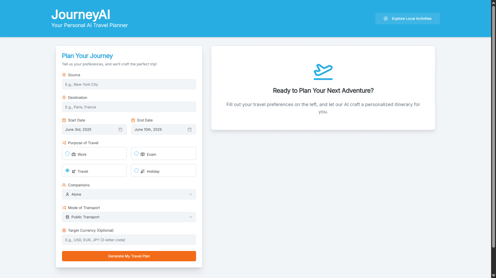
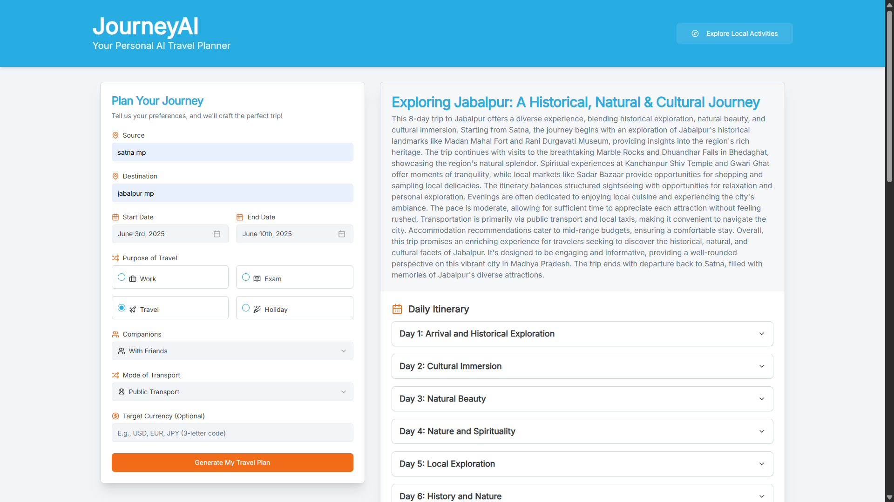
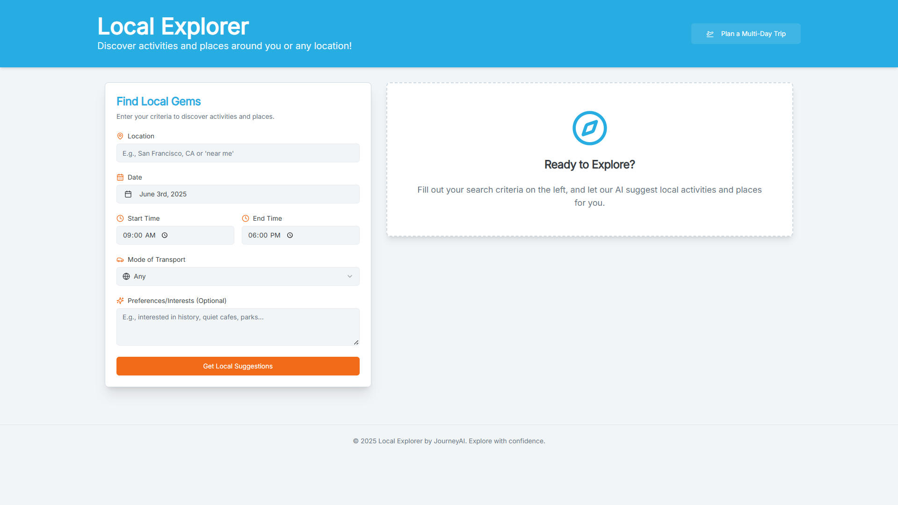
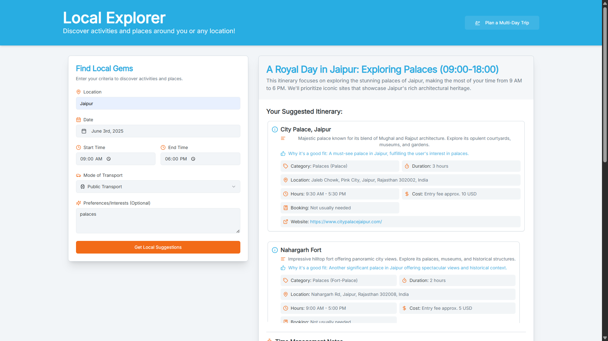

# JourneyAI - Your Personal AI Travel Planner

JourneyAI is an intelligent travel planning application designed to help users create detailed multi-day trip itineraries and discover local activities. Leveraging the power of AI, it provides personalized suggestions based on user preferences.

The application features two main functionalities:
1.  **JourneyAI (Multi-Day Trip Planner):** Plan comprehensive trips from start to finish, including daily activities, transportation, accommodation ideas, and more.
2.  **Local Explorer:** Discover activities, restaurants, and points of interest in a specific location for a defined time window.

## Screenshots


**Multi-Day Trip Planner (JourneyAI):**
*Planning your next big adventure is easy. Just fill in your preferences!*


*Receive a comprehensive, day-by-day itinerary tailored to you.*


**Local Activity Explorer:**
*Looking for something to do right now or in a specific area? Local Explorer has you covered.*


*Get detailed suggestions for local activities, including estimated times and costs.*


## Features

*   **AI-Powered Planning:** Utilizes Google's Gemini models via Genkit to generate travel plans and suggestions.
*   **Multi-Day Itineraries:**
    *   Specify source, destination, travel dates, trip purpose, companions, and preferred mode of transport.
    *   Optionally set a target currency for cost estimations.
    *   Receive a detailed plan including:
        *   Overall trip summary.
        *   Day-by-day breakdown (morning, afternoon, evening activities).
        *   Activity details (description, type, estimated duration, address, notes).
        *   Transportation advice (getting to the destination, inter-city travel, local transport).
        *   Accommodation recommendations.
        *   Estimated trip cost (in specified or default currency).
        *   Suggestions for best time to visit, packing list, local customs, and emergency contacts.
*   **Local Activity Exploration:**
    *   Search for activities in any location for a specific date and time window.
    *   Filter by preferred mode of transport and add custom preferences.
    *   Get suggestions for:
        *   Activity name, detailed description, category, and specific type.
        *   Estimated duration, address, and reason for suggestion.
        *   Opening hours (verified against user's available time).
        *   Estimated cost, booking needs, and official website.
        *   Overall time management notes, including travel between activities.
        *   General transportation advice for the area.
        *   An alternative suggestion.
*   **User-Friendly Interface:** Built with ShadCN UI components and Tailwind CSS for a modern and responsive experience.
*   **Client-Side Validation:** Uses React Hook Form and Zod for robust form handling and input validation.

## Tech Stack

*   **Frontend:**
    *   Next.js (App Router)
    *   React
    *   TypeScript
*   **UI:**
    *   ShadCN UI
    *   Tailwind CSS
    *   Lucide React (Icons)
*   **AI & Backend Logic:**
    *   Genkit
    *   Google Gemini (via `@genkit-ai/googleai`)
*   **State Management & Forms:**
    *   React Hook Form
    *   Zod (for schema validation and type safety)
*   **Utilities:**
    *   `date-fns` for date manipulation.

## Getting Started

Follow these instructions to set up and run the project locally.

### Prerequisites

*   Node.js (v18 or later recommended)
*   npm, yarn, or pnpm

### Installation

1.  **Clone the repository or ensure you have the project files.**

2.  **Navigate to the project directory:**
    ```bash
    cd your-project-directory
    ```

3.  **Install dependencies:**
    ```bash
    npm install
    # or
    # yarn install
    # or
    # pnpm install
    ```

### Environment Variables

The application uses Genkit to interact with Google's Generative AI models. You'll need a Google AI API key.

1.  **Create a `.env.local` file** in the root of your project.
2.  **Add your Google AI API key to the `.env.local` file:**
    ```env
    GOOGLE_API_KEY=YOUR_GOOGLE_AI_API_KEY
    ```
    Replace `YOUR_GOOGLE_AI_API_KEY` with your actual API key. You can obtain one from [Google AI Studio](https://aistudio.google.com/app/apikey).


### Running the Application

You need to run two development servers concurrently: one for the Next.js frontend and one for the Genkit AI flows.

1.  **Start the Next.js development server:**
    Open a terminal and run:
    ```bash
    npm run dev
    ```
    This will typically start the application on `http://localhost:9002`.

2.  **Start the Genkit development server:**
    Open a *new* terminal and run:
    ```bash
    npm run genkit:dev
    ```

Once both servers are running, you can access the application in your browser at the address provided by the Next.js server (e.g., `http://localhost:9002`).

## Project Structure

*   `src/app/`: Contains the Next.js pages using the App Router.
    *   `page.tsx`: Main page for multi-day trip planning (JourneyAI).
    *   `local-search/page.tsx`: Page for local activity exploration.
    *   `layout.tsx`: Root layout for the application.
    *   `globals.css`: Global styles and Tailwind CSS theme configuration.
*   `src/components/`:
    *   `journey-ai/`: Application-specific React components (forms, display components).
    *   `ui/`: ShadCN UI components.
*   `src/ai/`:
    *   `flows/`: TypeScript files defining the Genkit AI flows (e.g., `generate-travel-plan.ts`, `generate-local-travel-suggestions.ts`).
    *   `genkit.ts`: Genkit main configuration and initialization.
    *   `dev.ts`: Entry point for the Genkit development server.
*   `src/lib/`: Utility functions (e.g., `cn` for classnames).
*   `src/hooks/`: Custom React hooks (e.g., `use-toast`, `use-mobile`).
*   `public/`: Static assets.
*   `screenshots/`: (Recommended) Folder for your application screenshots.
*   `package.json`: Project dependencies and scripts.
*   `tailwind.config.ts`: Tailwind CSS configuration.
*   `next.config.ts`: Next.js configuration.
*   `tsconfig.json`: TypeScript configuration.

## How AI Works

The application uses [Genkit](https://firebase.google.com/docs/genkit) to define and run AI flows. These flows interact with large language models (LLMs), specifically Google's Gemini models, to:
*   Understand user input from the forms.
*   Generate structured travel plans based on defined Zod schemas.
*   Provide detailed descriptions, suggestions, and advice.

The prompts sent to the AI are carefully crafted within the flow files (e.g., `src/ai/flows/generate-travel-plan.ts`) to guide the model in producing the desired output format.

---

Happy travels and planning!

## Deploying

This app uses Next.js Server Actions with Genkit AI flows, so it must run on a Node.js server (static export is not supported).

### Railway (recommended)

The repo includes a production-ready `Dockerfile` and `railway.json`.

1. Push your repo to GitHub.
2. Create a [Railway](https://railway.app) project and connect the repository.
3. Railway will detect the `Dockerfile` and build the standalone Next.js app automatically.
4. Add the required environment variable in Railway:
   ```env
   GOOGLE_API_KEY=your_google_ai_api_key
   ```
5. Deploy. Railway exposes the app on a public URL once the health check passes.

### Docker (any host)

```bash
docker build -t journey-ai .
docker run -p 3000:3000 -e GOOGLE_API_KEY=your_key journey-ai
```

### Firebase App Hosting

An `apphosting.yaml` is included if you prefer Firebase App Hosting. Follow the [Firebase App Hosting docs](https://firebase.google.com/docs/app-hosting) and set `GOOGLE_API_KEY` in your backend environment.

### CI / deploy verification

GitHub Actions runs lint, typecheck, tests, and a production build on every push. Pushes to `main` also verify the Docker image builds successfully.

---

Happy travels and planning!
